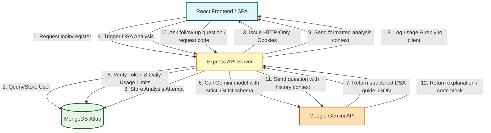

# AlgoMentor

[](https://react.dev/)
[](https://vite.dev/)
[](https://nodejs.org/)
[](https://expressjs.com/)
[](https://www.mongodb.com/)
[](https://ai.google.dev/)
[](https://jwt.io/)
[](https://zod.dev/)
[](https://vitest.dev/)

**AlgoMentor** is a full-stack, AI-powered Data Structures and Algorithms (DSA) learning and mentorship platform. Instead of merely providing immediate code solutions when a student gets stuck, AlgoMentor utilizes a metacognitive pedagogical approach. It breaks coding problems down into guided phases—helping users understand problem requirements, analyze constraints, uncover hidden edge cases, identify pattern archetypes, reveal progressive hints, study multiple approaches (from brute-force to optimal), and run step-by-step dry runs before generating code on demand.

---

## 📌 Table of Contents

1. [Project Overview](#-project-overview)
2. [Live Demo](#-live-demo)
3. [The Problem Statement](#-the-problem-statement)
4. [Core Features](#-core-features)
5. [Tech Stack](#-tech-stack)
6. [System Architecture & Data Flow](#-system-architecture--data-flow)
7. [Repository Structure](#-repository-structure)
8. [Database Schema Overview](#-database-schema-overview)
9. [Local Environment Setup](#-local-environment-setup)
10. [Environment Variables](#-environment-variables)
11. [Available Development Scripts](#-available-development-scripts)
12. [API Reference (Endpoints)](#-api-reference-endpoints)
13. [Deployment Details](#-deployment-details)
14. [Screenshots](#-screenshots)
15. [Technical Highlights & Learning Outcomes](#-technical-highlights--learning-outcomes)
16. [Future Enhancements](#-future-enhancements)
17. [Contributing](#-contributing)
18. [Author](#-author)
19. [License](#-license)

---

## 🔍 Project Overview

AlgoMentor is designed to support structured problem-solving habits in computer science students. It features a complete dashboard to import problems from external links or create them manually, track personal confidence levels, view cognitive progress, compare past analyses, and generate personalized revision lists. All coding analyses are powered by Google's Gemini API (`gemini-2.5-flash`) via the modern `@google/genai` SDK, ensuring high-quality and fast contextual guidance.

---

## 🌐 Live Demo

You can interact with the deployed application using the links below:

* **Frontend Client (Vercel):** [https://algo-mentor-sigma.vercel.app](https://algo-mentor-sigma.vercel.app)
* **Backend API (Render):** [https://algomentor-cie1.onrender.com](https://algomentor-cie1.onrender.com)
* **Health Check Endpoint:** [https://algomentor-cie1.onrender.com/api/v1/health](https://algomentor-cie1.onrender.com/api/v1/health)

---

## ⚠️ The Problem Statement

Many students learning DSA fall into the **"solution-searching trap"** or **"tutorial hell"**:
1. When encountering a difficult problem, they immediately look up code solutions on GitHub, YouTube, or LeetCode discussion tabs.
2. They copy-paste the optimal solution, run it, and assume they have learned the concept.
3. During interviews or assessments, they fail when asked to write alternative approaches, explain time/space complexities, or solve slight variations of the same problem.

**How AlgoMentor Solves This:**
AlgoMentor acts as a virtual private tutor that actively prevents immediate code-copying. It forces students to walk through a structured mental model:
* **Constraint & Edge-Case Comprehension:** Highlights constraints and prompts users about hidden inputs (e.g., negative values, empty arrays, integer overflows).
* **Archetype Recognition:** Helps students identify the core algorithmic patterns (e.g., Sliding Window, Two Pointers, BFS/DFS).
* **Incremental Hints:** Offers a sequential hint drawer, allowing students to break blocks without ruining the learning process.
* **On-Demand Execution:** Compares alternative approaches side-by-side and generates code/dry runs only when explicitly requested.
* **Metacognitive Tracking:** Prompts students to record confidence levels, review past analytical attempts, and revisit weak topics.

---

## 🚀 Core Features

### 🔐 1. Authentication & Security
* **JWT & Cookie Sessions:** Authenticated sessions secured via JWT tokens stored in HTTP-Only, secure cookies (with `sameSite: 'none'` in production) to handle cross-domain requests.
* **Secure Cryptography:** Secure user password storage using `bcryptjs` hashing.
* **Input Validation:** Enforces structural validations at boundary layers using `zod` schemas.

### 📝 2. Problem Onboarding & Import
* **Universal Manual Entry:** Create DSA problems with custom titles, descriptions, constraints, difficulty levels, and input/output test cases.
* **Metadata Import:** Import problem schemas directly using external platform URLs (e.g., LeetCode links) with built-in metadata extraction.

### 🧠 3. Interactive DSA Analysis Dashboard
* **AI Analysis Pipeline:** Requests structured JSON analysis structures from Gemini API outlining:
  * **Understanding:** Clear restatements of input, output, and constraints.
  * **Edge Cases:** Identifies 3–5 hidden cases to watch out for.
  * **Pattern Identification:** Connects the problem to standard DSA patterns.
  * **Incremental Hints:** Three distinct sequential hints leading towards the solution.
  * **Approach Breakdown:** Compares multiple approaches (from brute-force to optimal) showing their detailed logic, step-by-step dry runs, and time/space complexities.
* **On-Demand Code Generation:** Prevents solution-spoiling by showing code blocks only when requested.
* **On-Demand Dry Runs:** Displays execution traces illustrating variable states step-by-step.
* **Interactive AI Follow-up:** Submit contextual questions about the analysis and receive real-time explanations.

### 📊 4. Revision & Metacognitive Progress
* **Student Dashboard:** Visualizes analysis attempts, average confidence levels, weak patterns, and problem counts.
* **"Revise Today" Queue:** Suggests problems to revise based on user confidence history.
* **Analysis Comparison:** Select and view two separate analysis attempts side-by-side to track how your approach improved over time.
* **Custom Preferences:** Set preferred language (JavaScript, Python, C++, Java), target difficulty, and daily goals.

### 🛡️ 5. Platform Control & Integrity
* **Usage Limits & Protection:** Prevents API abuse by setting strict limits on daily analysis requests, follow-up submissions, and token usage via an `aiUsages` tracker.
* **Rate-Limiters:** Built-in `express-rate-limit` middleware for endpoints.
* **Stuck Analyses Recovery:** Admin tool to recover and reset stuck pending analyses.

---

## 🛠️ Tech Stack

### Frontend
* **Core Library:** React 19 (Functional Components, Custom Hooks)
* **Build Tool:** Vite 8
* **Styling:** Tailwind CSS (utility-first styling, glassmorphism UI elements, dark mode)
* **Routing:** React Router DOM v7 (protected & public layout nesting)
* **API Client:** Axios (configured with interceptors to automatically support credentials and cookie handshakes)
* **Code Display:** Monaco Editor (`@monaco-editor/react`) for code editing and visualization

### Backend
* **Runtime:** Node.js (ES Modules, `type: "module"`)
* **Framework:** Express.js 5
* **Database Object Modeling:** Mongoose 9
* **API Protection:** Express Rate Limit (individual limiters for login, registration, import, analysis, and follow-ups)
* **API Validation:** Zod
* **Testing Suite:** Vitest (unit & integration tests), Supertest (HTTP testing)

### Database & External Services
* **Primary Database:** MongoDB Atlas (NoSQL Document Store)
* **AI Orchestration:** Google Gemini API (`gemini-2.5-flash` model, configured with strict structured JSON schemas)

---

## 📊 System Architecture & Data Flow

Below is the request-response lifecycle illustrating how data flows between the client, backend, database, and Google Gemini API:



---

## 📂 Repository Structure

```text
AlgoMentor/
├── client/                     # Frontend SPA code
│   ├── public/                 # Static assets (favicons, manifest, etc.)
│   ├── src/                    # React source code
│   │   ├── api/                # Axios instances & endpoint queries
│   │   ├── assets/             # Global visual styling elements
│   │   ├── components/         # Reusable UI parts & layout wrappers (Public, Dashboard)
│   │   ├── context/            # AuthContext (global user state & login/logout handlers)
│   │   ├── hooks/              # Custom Hooks (auth, API state, responsive checks)
│   │   ├── pages/              # High-level route views (Dashboard, Analysis, Revision, etc.)
│   │   ├── routes/             # AppRoutes, ProtectedRoutes, GuestRoutes
│   │   ├── utils/              # Client-side utility functions & formatters
│   │   ├── App.css             # Main styling classes
│   │   ├── App.jsx             # App core root component
│   │   ├── index.css           # Tailwind CSS directives & imports
│   │   └── main.jsx            # Application mount point
│   ├── .env.sample             # Client environment template
│   ├── index.html              # HTML shell template
│   ├── package.json            # React project dependencies & scripts
│   ├── vercel.json             # Vercel deployment routing configuration
│   └── vite.config.js          # Vite plugins & proxy settings
│
├── server/                     # Backend API server code
│   ├── src/                    # Express application source code
│   │   ├── config/             # DB and client configuration settings
│   │   ├── controllers/        # Route controllers (Auth, Problem, Analysis, Practice, Admin)
│   │   ├── data/               # Static dataset configurations
│   │   ├── db/                 # MongoDB database connections
│   │   ├── middlewares/        # Express Middlewares (Auth, Error, Rate Limiting, Validation)
│   │   ├── models/             # Mongoose schemas (User, Problem, Analysis, AIUsage, Progress)
│   │   ├── routes/             # Route configurations
│   │   ├── services/           # External service handlers (Gemini API integrations)
│   │   ├── test/               # Vitest suite (Integration tests & mock data setup)
│   │   ├── utils/              # Backend formatting utilities & standard Response/Error wrappers
│   │   ├── validators/         # Zod schemas for sanitizing requests
│   │   ├── app.js              # Express app instantiation & CORS/middleware assembly
│   │   └── server.js           # Server listen initializer
│   ├── .env.sample             # Server environment variables template
│   ├── package.json            # Server dependencies, scripts, & test engines
│   └── vitest.config.js        # Vitest server configurations
│
├── docs/                       # Project documentation & configuration files
├── .editorconfig               # Workspace coding standard definitions
├── .gitignore                  # Global Git ignore policies
├── .prettierignore             # Prettier path exclusion rules
├── .prettierrc                 # Code format preferences
├── package.json                # Root package descriptor for keywords and settings
└── README.md                   # Project documentation index (this file)
```

---

## 🗄️ Database Schema Overview

AlgoMentor relies on seven structured collections in MongoDB:

1. **Users (`users`):** Stores credentials, roles (`student`, `admin`), and profile settings (programming language, target difficulty, daily analysis goals).
2. **Problems (`problems`):** Tracks titles, descriptions, difficulty, platform sources (LeetCode, Hackerrank, manual), test cases, and aggregated confidence.
3. **Analyses (`analyses`):** Stores structural JSON returned by Gemini API containing core comprehension, progressive hints, approach summaries, and dynamic flags indicating if code or dry runs have been unlocked.
4. **AnalysisFollowUps (`analysisfollowups`):** Keeps record of conversation logs between students and the AI concerning specific analysis instances.
5. **AiUsages (`aiusages`):** Stores token consumption, analysis requests, and follow-ups made by a user on a daily basis to prevent API quota exhaust.
6. **StudentPatternProfiles (`studentpatternprofiles`):** Maintains learning maps per algorithmic pattern (e.g. Backtracking, Dynamic Programming) to highlight weak and strong zones.
7. **RecommendationProgress (`recommendationprogresses`):** Tracks the progress of pattern-based recommendations generated for users.

---

## 💻 Local Environment Setup

To run AlgoMentor locally, follow these steps:

### Prerequisites
* **Node.js** (v20.x or higher recommended)
* **MongoDB** (Local Community Server or MongoDB Atlas account)
* **Gemini API Key** (Obtained from Google AI Studio)

### Step 1: Clone the Repository
```bash
git clone https://github.com/nimisha1505/AlgoMentor.git
cd AlgoMentor
```

### Step 2: Configure Environment Variables
Create `.env` files in both `client/` and `server/` directories using the provided templates:
```bash
# In the root folder:
cp client/.env.sample client/.env
cp server/.env.sample server/.env
```
Fill in the variables inside these files. Refer to [Environment Variables](#-environment-variables) for guidance.

### Step 3: Install Dependencies
Navigate into each directory and install:
```bash
# Install server dependencies
cd server
npm install

# Install client dependencies
cd ../client
npm install
```

### Step 4: Run the Development Servers
Open two terminal windows/tabs:

* **Terminal 1: Start the Backend Server**
  ```bash
  cd server
  npm run dev
  ```
  The server will spin up on the port specified in `.env` (default is `5000`), listening at `http://localhost:5000`.

* **Terminal 2: Start the Frontend Client**
  ```bash
  cd client
  npm run dev
  ```
  Vite will launch the local web server, usually at `http://localhost:5173`. Open this URL in your browser.

---

## 🔑 Environment Variables

The application requires specific configurations in each folder to operate:

### Server Environment Configurations (`server/.env`)
```env
PORT=5000                                               # Server listen port
MONGODB_URI=mongodb+srv://<user>:<password>@cluster.mongodb.net/algomentor  # Production DB
MONGODB_TEST_URI=mongodb://localhost:27017/algomentor_test # Testing local DB
NODE_ENV=development                                    # environment type (development/production)
CORS_ORIGINS=http://localhost:5173,http://localhost:5174  # Allowed CORS origins

ACCESS_TOKEN_SECRET=your_access_token_secret_here       # JWT signing key for access tokens
ACCESS_TOKEN_EXPIRY=15m                                 # Short duration access lifespan

REFRESH_TOKEN_SECRET=your_refresh_token_secret_here     # JWT signing key for refresh tokens
REFRESH_TOKEN_EXPIRY=7d                                 # Long duration refresh lifespan

GEMINI_API_KEY=your_gemini_api_key_here                 # API key from Google AI Studio
GEMINI_MODEL=gemini-2.5-flash                           # Gemini Model identifier

# Platform Usage Protections (Prevents free tier quota exhaust)
DAILY_ANALYSIS_LIMIT=20                                 # Max problem analyses per user per day
DAILY_FOLLOWUP_LIMIT=50                                 # Max follow-up questions per user per day
DAILY_TOKEN_LIMIT=250000                                # Max cumulative tokens per user per day
```

### Client Environment Configurations (`client/.env`)
```env
VITE_API_BASE_URL=http://localhost:5000/api/v1          # URL pointing to the Express server API
```

---

## 📜 Available Development Scripts

You can execute the following commands in the workspace:

### Client scripts (`client/package.json`)
* `npm run dev`: Runs Vite local dev server with Hot Module Replacement.
* `npm run build`: Bundles files and optimizes assets for production deployment.
* `npm run lint`: Performs rapid code formatting analysis using Oxlint.
* `npm run preview`: Previews the production build locally.

### Server scripts (`server/package.json`)
* `npm run start`: Starts the Express API using standard Node.js runtime.
* `npm run dev`: Boots the server in reload-on-change mode using Nodemon.
* `npm run test`: Executes integration tests once using Vitest.
* `npm run test:watch`: Runs Vitest in interactive watch mode for active editing.
* `npm run test:coverage`: Assesses code coverage metrics across database models and endpoints.

---

## 📡 API Reference (Endpoints)

All API endpoints are prefixed with `/api/v1`. Route handlers enforce JWT verification (`verifyJWT`) using HTTP-Only cookies unless marked as **[Public]**.

### 🔐 1. Authentication Router (`/auth`)
* `POST /register` **[Public]** - Registers a new student account (validated via Zod, rate-limited).
* `POST /login` **[Public]** - Validates credentials, issues JWT access token, and sets secure refresh token cookie.
* `POST /logout` - Clears backend refresh tokens and removes browser authentication cookies.
* `GET /current-user` - Retrieves profile details of the active authenticated user.
* `POST /refresh-token` **[Public]** - Validates browser's refresh token cookie and returns a fresh short-lived access token.
* `PATCH /profile` - Edits user fields (such as name, email) (Zod validated).
* `PATCH /change-password` - Overwrites existing password with high-entropy checks.

### ⚙️ 2. User Router (`/users`)
* `GET /preferences` - Fetches user settings (target difficulty, preferred languages, and goal structures).
* `PATCH /preferences` - Updates user preferences.

### 📂 3. Problem Router (`/problems`)
* `GET /` - Fetches a paginated, filterable array of problems created by the authenticated student.
* `POST /` - Creates a new problem manually (Zod validated).
* `POST /import` - Parses metadata (title, platform, URL, descriptions) from external links (rate-limited).
* `GET /:problemId` - Retrieves details of a specific problem.
* `PATCH /:problemId` - Updates details of a problem.
* `PATCH /:problemId/learning` - Updates learning state (e.g. status, confidence, revision intervals) (Zod validated).
* `DELETE /:problemId` - Deletes a problem.
* `POST /:problemId/analyses` - Calls Gemini API to perform DSA analysis (rate-limited).
* `GET /:problemId/analyses` - Returns the history of analysis requests made on a specific problem.
* `GET /:problemId/analyses/latest` - Returns the latest analysis for the target problem.
* `GET /:problemId/analyses/compare` - Takes `analysisA` and `analysisB` query parameters to compare differences.

### 🧠 4. Analysis Router (`/analyses`)
* `GET /:analysisId` - Retrieves details of a specific analysis attempt.
* `POST /:analysisId/approaches/:approachIndex/code` - Requests AI code generation for a specific approach.
* `POST /:analysisId/approaches/:approachIndex/dry-run` - Requests AI execution dry run for a specific approach.
* `POST /:analysisId/follow-ups` - Submits a follow-up query to Gemini API within the problem scope (rate-limited).
* `GET /:analysisId/follow-ups` - Retrieves conversation history for the analysis.

### 🎯 5. Practice & Insights Router (`/practice`)
* `GET /dashboard` - Aggregates student statistics, problem statistics, and confidence breakdowns.
* `GET /recommendations` - Recommends DSA topics based on weak patterns.
* `GET /recommendations/progress` - Returns completion progress on current recommendations.
* `PATCH /recommendations/:recommendationKey` - Updates state of recommended target items.
* `GET /usage` - Returns daily AI request counters against system limits.

### 🛡️ 6. Admin Router (`/admin`)
* `POST /recovery/analyses` **[Admin Only]** - Scans database for hung analyses and forces state reset.

---

## 📦 Deployment Details

The AlgoMentor app is structured for cloud hosting:

1. **Frontend Hosting (Vercel):**
   * Configured via `client/vercel.json` to route all single-page app (SPA) requests to `index.html` to allow React Router handling.
   * Connects to backend endpoints using `VITE_API_BASE_URL` pointing to the Render domain.
2. **Backend API (Render):**
   * Configured to run `npm run start`.
   * Requires environment configurations for database access, JWT secrets, and the Google Gemini API key.
3. **Database (MongoDB Atlas):**
   * Uses a managed MongoDB cluster. Host origins of Render and local hosts are whitelisted in Atlas Network Access configurations.

---

## 🖼️ Screenshots

### Dashboard
_Add screenshot here_

### New Problem Analysis
_Add screenshot here_

### Analysis Detail
_Add screenshot here_

### Saved Problems and Revision
_Add screenshot here_

---

## 🎯 Technical Highlights & Learning Outcomes

This project demonstrates several production-ready engineering patterns valuable for recruiters:

* **Pedagogical AI Prompt Engineering:** Implements strict structured outputs using the new `@google/genai` SDK. Ensures Gemini returns structured JSON matching precise schema validations without escaping raw strings, eliminating typical formatting failures.
* **Safe Cookie Session Handshake:** Configures cookie credentials (`httpOnly`, `secure`, `sameSite: "none"`) in CORS mappings. This allows the decoupled client (Vercel) and server (Render) to verify sessions across distinct subdomains securely.
* **Security & Input Sanitization:** Rejects payload injections at controller entry bounds. Ensures all inputs are verified through strict Zod validators, preventing schema-level query anomalies in MongoDB.
* **Resilient Test Coverage:** Employs Vitest and Supertest to write unit and integration checks across the route boundary layers, verifying database operations and request handling.
* **Defensive API Quota Management:** Incorporates token counting and user daily counters (`aiusages` collection) to prevent denial-of-wallet scenarios while using pay-as-you-go LLM backends.

---

## 🔮 Future Enhancements (Planned Ideas - Not Currently Implemented)

The following features are planned conceptual additions and are **not** currently implemented in the codebase:

* **Sandbox Compiler Execution:** Embedding a WebAssembly execution environment or secure sandbox runtime to execute solutions directly in the browser.
* **Gamified Challenges & Contests:** Daily leaderboard challenges, level progression, and badges to encourage user consistency.
* **Collaborative Peer Study Rooms:** Multi-user interactive workspace integrating WebRTC and Socket.io to walk through problem hints and analyses collaboratively.
* **Local/Offline AI Integration:** Options to connect specialized small local language models (SLMs) like DeepSeek-Coder or Llama-3 for cost-free, high-speed coding assistance.

---

## 🤝 Contributing

Contributions are welcome! Please follow these steps to contribute:

1. Fork the Project.
2. Create a Feature Branch (`git checkout -b feature/AmazingFeature`).
3. Commit your Changes (`git commit -m 'Add some AmazingFeature'`).
4. Push to the Branch (`git push origin feature/AmazingFeature`).
5. Open a Pull Request.

Please ensure your modifications pass existing test suites (`npm run test` on the server) and formatting criteria before requesting a review.

---

## 👤 Author

**Nimisha Agarwal**

- GitHub: [nimisha1505](https://github.com/nimisha1505)
- LinkedIn: [Add LinkedIn profile](YOUR_LINKEDIN_URL)
- Email: `YOUR_PROFESSIONAL_EMAIL`

---

## 📄 License

No separate license file has been added yet.
